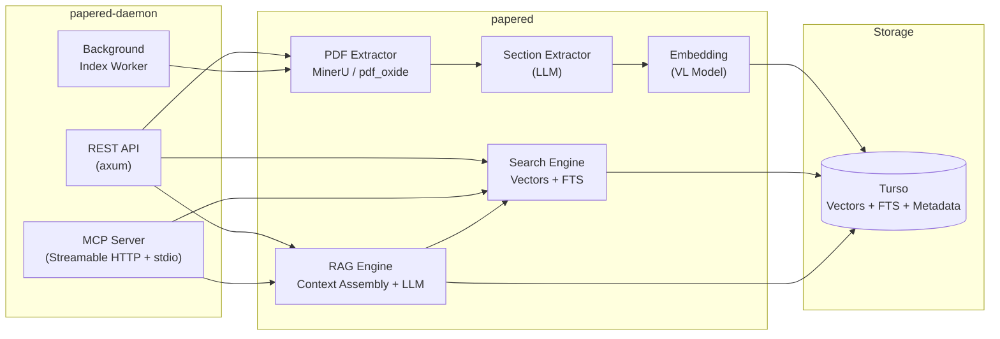
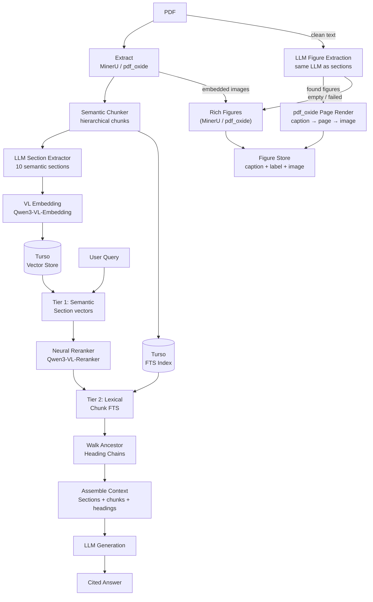

# Papered — REST API & Developer Reference

> For user-facing setup and MCP configuration, see [README.md](README.md).

---

## Architecture



### Processing Pipeline



Two-tier retrieval: vector similarity over section vectors finds relevant papers → neural cross-encoder reranks → Turso FTS locates exact passages within them → ancestor headings provide structural context.

---

## REST API

The daemon exposes a JSON REST API on `http://127.0.0.1:9321` by default. If that port is occupied, it tries 9322–9330 and writes the actual port to `~/Library/Application Support/papered/daemon.port`.

| Method | Path | Description |
|--------|------|-------------|
| `GET` | `/health` | Liveness check |
| `GET` | `/api/v1/health` | Full health (paper count, vector count, embedding info) |
| `GET` | `/api/v1/health/kb` | KB integrity health |
| `POST` | `/api/v1/health/cleanup` | Clean up orphaned data |
| `POST` | `/api/v1/health/optimize` | Optimize Turso FTS indices + clear caches |
| `POST` | `/api/v1/health/optimize-images` | Re-encode all figure images per current `pdf_extraction` settings; supports `dry_run` preview (see below) |
| `POST` | `/api/v1/health/regenerate-covers` | Regenerate covers + thumbnails for all papers that have a PDF file |
| `GET` | `/api/v1/health/quality` | Data quality report (papers with indexing issues) |
| `GET` | `/api/v1/health/image-quality` | Image quality report (missing/bad figure files) |
| `GET` | `/api/v1/health/duplicates` | Duplicate paper groups detected by file hash or metadata |
| `POST` | `/api/v1/health/cleanup-images` | Remove dangling figure records with missing image files |
| `GET` | `/api/v1/stats` | Paper/vector/figure/table counts + disk size. Also returns `data_dir` and `config_path` (absolute paths as strings; `config_path` is empty if unresolved) |
| `GET` | `/api/v1/metrics` | LLM call metrics: token usage + latency aggregated by (kind, model), all-time and last 24h |
| `GET` | `/api/v1/config` | Get config (API keys returned verbatim — localhost only). Response carries an `ETag` content hash |
| `PUT` | `/api/v1/config` | Update config. Send `If-Match: <etag>` for optimistic concurrency — a stale tag is rejected with `409 config_conflict`; omit the header to skip the check |
| `GET` | `/api/v1/setup/status` | First-run setup status: `{ needs_setup, reasons }` |
| `POST` | `/api/v1/config/embedding` | Hot-swap embedding model |
| `POST` | `/api/v1/test-endpoint` | Test LLM endpoint connectivity |
| `POST` | `/api/v1/test-embedding` | Test embedding endpoint connectivity |
| `POST` | `/api/v1/test-reranker` | Test reranker endpoint connectivity (`{api_base, api_key, model}` → `{status, error?}`) |
| `GET` | `/api/v1/papers` | List papers (pagination + filter/sort) |
| `GET` | `/api/v1/papers/{id}` | Get paper metadata |
| `PUT` | `/api/v1/papers/{id}` | Update paper metadata |
| `DELETE` | `/api/v1/papers/{id}` | Delete paper + vectors |
| `POST` | `/api/v1/papers` | Add paper by server-side file path (multi-format) |
| `POST` | `/api/v1/papers/import` | Upload file (multipart, multi-format) |
| `POST` | `/api/v1/papers/pick-file` | Open a native file picker on the daemon host and return the selected paths (see below) |
| `POST` | `/api/v1/papers/batch` | Batch add papers from file paths |
| `POST` | `/api/v1/papers/batch-status` | Batch get paper status |
| `POST` | `/api/v1/papers/batch-delete` | Batch delete papers |
| `POST` | `/api/v1/papers/batch-reindex-sections` | Batch reindex sections only |
| `GET` | `/api/v1/papers/{id}/sections` | Get paper sections |
| `GET` | `/api/v1/papers/{id}/figures` | Get paper figures (with absolute image paths) |
| `GET` | `/api/v1/papers/{id}/figures/{figure_id}/image` | Serve a figure's image bytes (containment-checked under the paper directory) |
| `GET` | `/api/v1/papers/{id}/cover` | Serve the paper's full-size cover image |
| `GET` | `/api/v1/papers/{id}/cover/thumb` | Serve the paper's cover thumbnail (small). A missing thumbnail file is a plain 404 — rebuild with `POST /api/v1/health/regenerate-covers` |
| `POST` | `/api/v1/papers/{id}/cover/regenerate` | Regenerate one paper's cover + thumbnail from its PDF |
| `GET` | `/api/v1/papers/{id}/chunks/{chunk_id}` | Get a single chunk (passage) by ID, with its heading path — resolves RAG citation locators |
| `POST` | `/api/v1/papers/{id}/reindex` | Reindex paper (full) |
| `POST` | `/api/v1/papers/{id}/reindex-sections` | Reindex sections only |
| `GET` | `/api/v1/papers/{id}/rating` | Get the user's star rating (`{ paper_id, rating }`, `rating` is `null` when unrated) |
| `PUT` | `/api/v1/papers/{id}/rating` | Set/replace the star rating (`{ rating }`, 1–5) |
| `DELETE` | `/api/v1/papers/{id}/rating` | Clear the rating |
| `GET` | `/api/v1/papers/{id}/comments` | List comments, oldest first |
| `POST` | `/api/v1/papers/{id}/comments` | Add a comment (`{ content }`, non-empty, ≤ 4000 characters — 400 above that) |
| `DELETE` | `/api/v1/papers/{id}/comments/{comment_id}` | Delete a comment |
| `POST` | `/api/v1/papers/{id}/insights` | Generate an LLM insight/critique/inspiration draft for the paper (`{ insight }`); uses the `rag` purpose model, nothing is stored |
| `POST` | `/api/v1/papers/{id}/translate` | Translate one content item (`{ target_language, content_type, content_ref }`); returns cached result when the source is unchanged |
| `POST` | `/api/v1/papers/{id}/translate/batch` | Batch-translate content; with an empty `items` list it auto-collects title + abstract + sections + figure captions |
| `GET` | `/api/v1/papers/{id}/translations` | List a paper's translations (`?lang=zh-CN`) |
| `DELETE` | `/api/v1/papers/{id}/translations` | Delete all of a paper's translations |
| `GET` | `/api/v1/translations/search` | Full-text search across translated content (`?q=...&limit=20`) |
| `POST` | `/api/v1/search` | Semantic/fulltext/hybrid paper search |
| `POST` | `/api/v1/search/figures` | Semantic figure search |
| `POST` | `/api/v1/similar` | Find similar papers by paper_id |
| `GET` | `/api/v1/graph` | Paper relatedness graph (`?limit=200&max_edges_per_node=5&focus=<paper_id>`); `focus` force-includes a located paper with its strongest library-wide neighbors when it would be absent or isolated in the most-recent slice |
| `POST` | `/api/v1/ask` | RAG Q&A with citations |
| `GET` | `/api/v1/prompts` | List RAG prompts |
| `GET` | `/api/v1/prompts/{id}` | Get prompt by ID |
| `POST` | `/api/v1/prompts` | Create prompt |
| `PUT` | `/api/v1/prompts/{id}` | Update prompt |
| `DELETE` | `/api/v1/prompts/{id}` | Delete prompt |
| `POST` | `/api/v1/prompts/{id}/default` | Set default prompt |
| `POST` | `/api/v1/export` | Export data (json/csv/markdown/sqlite) |
| `GET` | `/api/v1/import-queue` | Get import queue status |
| `GET` | `/api/v1/lattice/status` | Lattice sync status |
| `GET` | `/api/v1/lattice/collections` | List available Lattice collections |
| `PUT` | `/api/v1/lattice/sync-collections` | Set which Lattice collections to sync |
| `GET` | `/api/v1/lattice/search` | Search Lattice library |
| `POST` | `/api/v1/lattice/sync` | Trigger Lattice sync |
| `POST` | `/api/v1/lattice/sync/cancel` | Cancel running Lattice sync |
| `POST` | `/api/v1/import/lattice` | Import paper from Lattice |
| `GET` | `/api/v1/zotero/status` | Zotero desktop connectivity status |
| `GET` | `/api/v1/zotero/collections` | List Zotero collections |
| `POST` | `/api/v1/zotero/sync` | Trigger one-shot Zotero sync |
| `GET` | `/api/v1/zotero/sync/{id}` | Get Zotero sync status by sync ID |
| `POST` | `/api/v1/zotero/sync/cancel` | Cancel running Zotero sync |
| `POST` | `/api/v1/reset-data` | Reset all data (preview or delete papers/vectors/files) |

File paths accepted by `POST /api/v1/papers`, `POST /api/v1/papers/batch`, and
`POST /api/v1/import/lattice` are normalized as users naturally paste them:
surrounding quotes are stripped, terminal drag-and-drop backslash escapes
(`\ `, `\(`) are unescaped, and a leading `~/` expands to the home directory.

`POST /api/v1/papers/batch` returns `{ results, queued, errors }`. Each entry
in `results` carries the requested `file_path` (plus `id`/`title`/`status` on
success), so per-file failures (`status: "error"` with an `error` message) can
be attributed to their path.

`POST /api/v1/papers/pick-file` opens a native open-file dialog on the daemon
host (osascript on macOS, rfd elsewhere) and returns `{ paths: [...] }`. A user
cancel is not an error: it returns `200` with an empty `paths` array. If the
dialog itself fails to open, the endpoint returns `5xx` with a readable
`message` so clients can fall back to manual path entry.

### RAG Answers & Citations

`POST /api/v1/ask` returns `{ answer, sources, search_method }`. The default
prompt instructs the model to cite inline with `[1]`, `[2]`, ... matching the
1-based order of `sources`, so clients can map answer markers to sources
programmatically. Each source carries structured chunk-level locators:

```json
{
  "answer": "The method uses ... [1]",
  "sources": [
    {
      "paper_id": "paper_abc",
      "title": "...",
      "content": "...",
      "score": 0.87,
      "citations": [
        { "chunk_id": "paper_abc_p12", "section_path": "Methods > Training", "page_number": 6 }
      ]
    }
  ],
  "search_method": "hybrid"
}
```

`citations` is empty when a source was assembled from section summaries rather
than chunks. Resolve a locator with
`GET /api/v1/papers/{paper_id}/chunks/{chunk_id}`, which returns the chunk plus
its `heading_path` (e.g. `"Methods > Training"`).

### LLM Call Metrics

`GET /api/v1/metrics` reports usage and latency for every instrumented provider
call (chat, embedding, rerank, vision), aggregated per `(kind, model)` group.
Recording is best-effort and never affects the calls themselves. Token fields
are `0` when the provider does not report usage (e.g. rerank endpoints).

**Response:**

```json
{
  "all_time": [
    {
      "kind": "chat",
      "model": "qwen3-32b",
      "calls": 120,
      "failures": 2,
      "prompt_tokens": 340000,
      "completion_tokens": 48000,
      "avg_latency_ms": 1820.5
    }
  ],
  "last_24h": []
}
```

`all_time` covers the whole `llm_call_metrics` table; `last_24h` applies the
same aggregation restricted to calls recorded in the last 24 hours. Both lists
are ordered by `(kind, model)`.

### Reset Data

`POST /api/v1/reset-data` clears indexed papers and vectors, with optional file-system cleanup.

**Request body:**

```json
{
  "force": false,
  "all": false
}
```

- `force` (default `false`): When `false`, returns a preview of what would be removed without deleting anything. When `true`, performs the reset.
- `all` (default `false`): When `true`, also removes `logs/` and `cache/` directories.

**Response:**

```json
{
  "status": "ok",
  "preview": true,
  "removed_paths": ["/path/to/papers", "/path/to/covers"],
  "bytes_freed": 0,
  "message": "Preview: 2 items would be removed (1.23 GB). Run with force=true to apply."
}
```

When `force=true`, `preview` is `false` and `bytes_freed` reports the actual bytes removed.

### Optimize Images

`POST /api/v1/health/optimize-images` re-encodes all extracted figure images
in place using the current `pdf_extraction` settings (format, quality,
max long side). The request body is optional:

```json
{ "dry_run": true }
```

- `dry_run` (default `false`): estimate sizes without touching any file or
  database record — the web UI uses this to preview savings before the
  destructive re-encode.

The response reports counts (`papers_scanned`, `images_processed`,
`images_skipped`, `images_failed`), raw byte totals (`bytes_before`,
`bytes_after`, `bytes_saved`), human-readable sizes (`size_before`,
`size_after`, `saved`), and echoes `dry_run`. When `extract_images = false`
in config, the endpoint rejects with `400 config_error` (a configuration
state, not a server error).

### Papers

`GET /api/v1/papers` supports pagination, sorting, and structured filtering:

- `limit` / `offset` — pagination
- `status` — filter by paper status
- `paper_type` — exact-match paper type (e.g. `research_article`, `review`)
- `species`, `gene`, `technique`, `pathway` — exact-match bio-entity filters; multiple combine with AND. Gene matching is case-sensitive.
- `sort_by` — `title`, `published_date`, or `updated_at`
- `sort_order` — `asc` or `desc`

Response: `{ papers: [...], total, has_more }`. Each entry in `papers` is the
paper object plus the user's annotation summary: `rating` (1–5, omitted when
unrated) and `comment_count` — fetched in one batch query per request, so list
clients never need per-row annotation lookups.

`GET /api/v1/papers/{id}` returns paper metadata including:

```json
{
  "id": "...",
  "title": "...",
  "entities": {
    "species": ["Oryza sativa"],
    "genes": ["OsALS"],
    "techniques": ["RNA-seq", "CRISPR"],
    "pathways": ["MAPK signaling"]
  }
}
```

Entities are populated from the `paper_entities` table; papers indexed before this feature was added return empty arrays until reindexed.

`POST /api/v1/papers/{id}/reindex` re-runs the full indexing pipeline for one paper. The CLI also provides `papered reindex --all`, which paginates through the library and queues every paper for reindexing (useful for backfilling entities and costs LLM calls).

---

## Advanced Configuration

### MinerU PDF Extraction

MinerU provides best extraction quality for complex PDFs (tables, formulas, multi-column). Falls back to pdf_oxide (zero-dependency) when unavailable.

Endpoint URLs are hardcoded per mode (`MinerUMode::base_url()`): Precision uses `https://mineru.net/api/v4`, Lightweight uses `https://mineru.net/api/v1/agent`. The old `endpoint` / `poll_interval_secs` keys were removed (`papered config set mineru.endpoint` reports the removal).

```toml
[mineru]
enabled = true
mode = "precision"          # precision | lightweight
model_version = "pipeline"  # pipeline | vlm | MinerU-HTML (precision only)
timeout_secs = 30
api_key = "your-key"        # required for precision mode
max_poll_time_secs = 600
enable_table = true
is_ocr = true               # OCR for scanned pages
enable_formula = true
language = "ch"
# page_range = "1-10"       # optional page range, lightweight mode only
```

### PDF Extraction Quality

Configure artifact removal, image filtering, and text quality thresholds for the built-in pdf_oxide extractor. These settings are ignored when MinerU is active.

```toml
[pdf_extraction]
artifact_threshold = 0.85            # 0.0-1.0; higher = more aggressive header/footer removal
min_image_short_side = 220           # px; discard tiny image fragments
max_image_long_side = 9000           # px; treat oversized images as watermarks
min_image_file_size_bytes = 16384    # discard placeholder/corrupted images
max_image_file_size_bytes = 20971520 # 20 MiB cap for abnormal image streams
output_max_long_side = 5120          # px; resize extracted figures before persisting
output_quality = 85                  # 1-100; JPEG/WebP output quality
output_format = "auto"               # auto | jpeg | webp | png
extract_images = true                # false = skip figure/table image extraction
min_title_chars = 3                  # Unicode-aware title threshold
quality_min_chars = 50               # minimum extracted text characters
quality_min_words = 10               # minimum estimated word count
quality_min_lines = 2                # minimum line count
quality_min_alphanumeric_ratio = 0.40 # min ratio of alphanumeric chars
quality_warn_threshold = 70          # score 0-100; below = IndexWithWarning
quality_reject_threshold = 30        # score 0-100; below = Reject
enable_layout_quality_signals = true # use pdf_oxide layout signals
min_chars_per_page = 20              # skip nearly-empty pages
max_pages_warning = 5000             # log warning for very long documents
```

**Image output notes:**
- `output_format = "auto"` keeps transparent images as WebP and stores everything else as JPEG.
- The built-in WebP encoder is lossless-only; explicit `"webp"` usually produces larger files than JPEG for paper figures.
- Set `extract_images = false` to skip image extraction entirely and reduce storage.
- Run `papered optimize-images` to re-compress existing images after changing these settings.

### RAG Advanced Options

```toml
[rag.enhancement]
temperature = 0.3
max_output_tokens = 16384
```

The unified enhancement layer performs one LLM call per new query to produce
both a rewritten query and a hypothetical document. When adaptive retrieval is
enabled, Normal and Complex queries automatically use enhancement; the original
query, rewritten query, and hypothetical-document embedding are searched and
fused with Reciprocal Rank Fusion (RRF).

### Translation

Paper content (title, abstract, sections, figure captions) can be translated
into a target language and stored for later viewing and full-text search,
avoiding paying for the same translation twice.

```toml
[purposes]
# translation = "deepseek-v4-flash"  # optional — defaults to the rag model

[translation]
target_language = "zh-CN"  # "zh-CN" | "en" | "fr" | "de" | "es" | "ru"
```

- `target_language` — default language used by the web UI translation panel;
  also settable in the first-run wizard and Settings.
- `purposes.translation` — optional model override for translation. When
  omitted, the `rag` model is used.

Translations are stored uniquely by
`(paper_id, content_type, content_ref, target_language)`. Each record keeps a
`source_hash` of the original text, so a translate request returns the cached
result when the source is unchanged and re-translates when it has changed.
`content_type` is one of `title`, `abstract`, `section`, `figure_caption`;
`content_ref` is `_self` for title/abstract, the section type for sections, and
the figure id for captions. Translated text is indexed in an FTS5 table and
searchable via `GET /api/v1/translations/search`.

### Lattice Sync

```toml
[lattice_sync]
enabled = true
interval_secs = 300
batch_limit = 50
pdf_search_paths = ["/Users/you/Papers"]
# collections = ["AI4S", "Reading List"]   # optional: sync only these named collections
```

`enabled` gates only the automatic background scheduler. A manual sync
(`POST /api/v1/lattice/sync` or the Sync page's "Sync now") is an explicit
user request and runs regardless of it.

Each cycle first checks the Lattice status endpoint and aborts if the
`search` or `paper-detail` capability is missing. It then enumerates the
Lattice library through the local search API, paging `batch_limit` results
at a time. When `collections` is empty (the default), the full library is
enumerated. When `collections` contains one or more collection names, only
those collections are enumerated and synced.

Papers not yet imported are added (matched by Lattice ID, so re-runs never
duplicate; already-imported metadata is not refreshed), and imported papers
that are no longer in the selected sync domain are removed. When collection
filtering is active, "selected sync domain" means the configured collections;
any previously imported Lattice paper outside those collections is treated as
removed, mirroring Zotero collection-filter semantics. If enumeration fails
or is cancelled partway the cycle aborts without removing anything, so an API
failure can never look like a mass deletion.

Use `GET /api/v1/lattice/collections` or `papered lattice collections` to
list available collections. Set the sync scope from the Sync page or with
`PUT /api/v1/lattice/sync-collections` (`{"collection_names": ["AI4S"]}`) —
empty means sync all.

Automatic sync is protected by a circuit breaker: after 5 consecutive
run-level failures (e.g. the Lattice app is unreachable) the daemon pauses
automatic sync and logs an error; a successful manual sync
(`POST /api/v1/lattice/sync`) resets the counter and resumes it.
`GET /api/v1/lattice/status` reports this via `auto_sync_paused` and
`consecutive_failures`.

### Zotero Sync

Requires the Zotero desktop app to be running (syncs via its local HTTP API).

```toml
[zotero_sync]
enabled = true
interval_secs = 300
batch_limit = 50
collection_keys = []
download_pdf = true
pdf_search_paths = []
recursive_collections = true
```

`batch_limit` is the page size, not a cap: every cycle paginates through all
matching items (incrementally by Zotero library version, full scan on the
first run). Zotero-imported papers deleted from Zotero are removed from
Papered; manually added papers are never touched.

`enabled` gates only the automatic background scheduler. A manual sync
(`POST /api/v1/zotero/sync` or the Sync page's "Sync now") is an explicit
user request and runs regardless of it.

| Endpoint | Description |
|----------|-------------|
| `GET /api/v1/zotero/status` | Check Zotero desktop connectivity |
| `GET /api/v1/zotero/collections` | List available collections |
| `POST /api/v1/zotero/sync` | Run a one-shot sync, returns `SyncReport` |
| `GET /api/v1/zotero/sync/{id}` | Get sync status by sync ID |
| `POST /api/v1/zotero/sync/cancel` | Cancel the running sync |

Automatic sync is protected by a circuit breaker: after 5 consecutive
run-level failures (e.g. the Zotero desktop app is not running) automatic
sync is paused and an error is logged; a successful manual sync
(`POST /api/v1/zotero/sync`) resets the counter and resumes it.
`GET /api/v1/zotero/status` reports this via `auto_sync_paused` and
`consecutive_failures`.

The daemon runs Zotero sync on startup and every `interval_secs` thereafter. Config changes are hot-reloaded via the file watcher on `config.toml`.

---

Figure extraction, section types, storage, and module layout are documented in
[`docs/architecture.md`](docs/architecture.md) and [`docs/figure-extraction.md`](docs/figure-extraction.md).

---

## License

Apache License 2.0 — see [LICENSE](LICENSE).

Copyright 2026 Chenhua Wu
