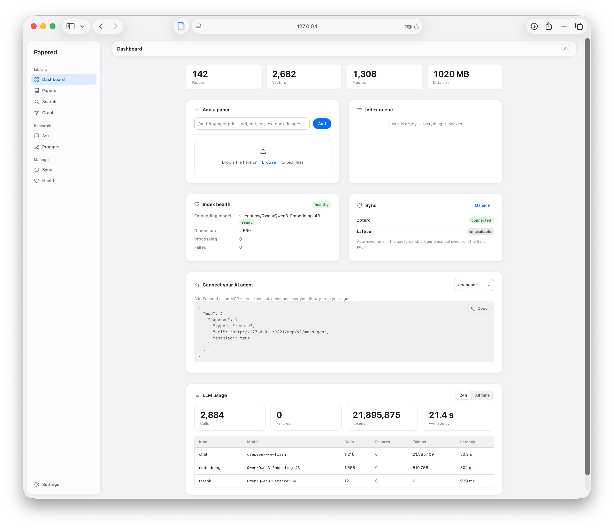

<p align="center">
  
  
  
  

<h1 align="center">Papered</h1>

<p align="center">
  Context infrastructure for research agents and researchers: a local-first paper knowledge engine that lets AI agents<br>
  query precise, grounded literature information without interrupting your flow.
</p>

---

### Why Papered

Pasting entire PDFs into a chat burns tokens and loses citations.
Papered indexes your library on disk so agents can search, ask
questions, and read passages — one at a time, with sources attached.

- **Cited answers.** Every RAG answer cites its source passages. Agents verify by calling `get_passage` with the returned chunk IDs.
- **Index once, search forever.** No re-ingesting or re-processing.
- **Runs locally.** No telemetry, no sign-up. Agents can only read.

## Quick Start

### Install

**macOS / Linux** (user-scope install to `~/.local/bin`, auto-detects arch, verifies SHA-256):
```bash
curl -fsSL https://raw.githubusercontent.com/WuChenh/papered/main/install.sh | sh
```

**Windows** (PowerShell, user-scope install, auto-adds to PATH):
```powershell
irm https://raw.githubusercontent.com/WuChenh/papered/main/install.ps1 | iex
```

Pin a specific release with `PAPERED_VERSION=vX.Y.Z` (Unix) or `$env:PAPERED_VERSION="vX.Y.Z"` (Windows)
before piping to the installer. See [`install.sh`](install.sh) / [`install.ps1`](install.ps1)
for the `INSTALL_DIR` / `PAPERED_REPO` overrides.

**Manual download:** grab the archive for your platform from the
[Releases page](https://github.com/WuChenh/papered/releases), verify it against
the bundled `SHA256SUMS.txt`, then put `papered` and `papered-daemon` on your PATH.

**From source:**
```bash
git clone https://github.com/WuChenh/papered.git
cd papered
cargo install --path crates/papered && cargo install --path crates/papered-daemon
papered ui
```

### First run

`papered ui` starts the daemon and opens the **web UI**. The first-run wizard
walks you through connecting an LLM provider and writes the config for you.

<p align="center">
  
</p>

Need manual control? See [`examples/config-minimal.toml`](examples/config-minimal.toml)
and the [full reference](examples/config.toml). For Apple Silicon, try [oMLX](examples/config-omlx.toml).

### Keep the Daemon Running

The daemon must stay alive for the CLI and MCP clients to work. See [`examples/`](examples/) for platform-specific service files:

| Platform | Example file | Quick setup |
|----------|-------------|-------------|
| macOS | `com.papered.daemon.plist` | Copy to `~/Library/LaunchAgents/`, run `launchctl load` |
| Linux | `papered-daemon.service` | Copy to `~/.config/systemd/user/`, `systemctl --user enable --now` |
| Windows | `windows-task-scheduler.ps1` | Run in PowerShell as Administrator |

All service files include auto-start and crash recovery.

## Features

**Hybrid Search.** Semantic + lexical + neural reranking with adaptive query weighting.

**Section-Based RAG.** Cited answers grounded in indexed passages with source verification via `get_passage`.

**Multimodal.** Figures extracted, described by LLM, embedded, and searchable.

**Translation.** Translate titles, abstracts, sections, and figure captions into your target language. Results are cached (re-translated only when the source changes), stored, and full-text searchable.

**Reference Manager Sync.** Background sync with Lattice and Zotero (via local API).

**MCP Server 2025-11-25.** 10 read-only tools over Streamable HTTP and stdio.

**Bio-entity Extraction.** Species, genes, techniques, and pathways extracted during indexing as filterable fields.

**Local-First & Private.** Turso on your filesystem. You control the LLM endpoints. No telemetry.

## MCP Server

Both transports implement **MCP 2025-11-25** and expose 10 read-only tools. Write operations (indexing, deleting, config, exports) use the REST API.

| Transport | Command |
|-----------|---------|
| Streamable HTTP | `papered-daemon` (default) |
| stdio | `papered-daemon --stdio` |

**Available MCP Tools (read-only):**

| Tool | Purpose |
|------|---------|
| `search_papers` | Discover papers by query. Returns metadata (title, authors, venue, DOI, date, type, keywords) with optional abstracts and relevance scores. |
| `search_passages` | Granular text retrieval. Search passages across all papers or within a specific paper. |
| `search_figures` | Search figures, charts, and diagrams by caption and description. |
| `get_paper_passages` | Retrieve all passages from a known paper (useful for deep reading). |
| `get_passage` | Fetch a single passage (chunk) by ID. Resolves the chunk IDs returned in `ask_rag` citations. Returns passage text, page number, and heading path. |
| `find_similar_papers` | Discover semantically related papers given a paper ID. |
| `ask_rag` | Ask a natural-language question and get a cited answer grounded in the paper library. |
| `get_paper_details` | Fetch full metadata and optionally extracted sections (abstract, methodology, findings, etc.) for a paper. |
| `list_papers` | Browse the library with pagination. |
| `get_index_status` | Check library stats (paper count, vector count). |

### Client Configuration

All client configuration examples are in the [`examples/`](examples/) directory:

| Client | Transport | Config File | Target Path |
|--------|-----------|-------------|-------------|
| Hermes | Streamable HTTP | [`hermes-mcp-config.yaml`](examples/hermes-mcp-config.yaml) | `~/.hermes/config.yaml` |
| OpenCode | Streamable HTTP | [`opencode-mcp-config.json`](examples/opencode-mcp-config.json) | project or global config |
| Claude Code | stdio | [`claude-code-mcp-config.json`](examples/claude-code-mcp-config.json) | project `.mcp.json` (or `claude mcp add-json`) |

**Notes:**
- For stdio transports, edit the config to set the **absolute path** to your `papered-daemon` binary.
- If port `9321` is occupied, the daemon tries `9322`–`9330` and records the chosen port in `~/Library/Application Support/papered/daemon.port`. Update the `url` in Streamable HTTP configs if needed.
- Manual test for stdio: run `papered-daemon --stdio`, then type `{"jsonrpc":"2.0","id":1,"method":"initialize","params":{"protocolVersion":"2025-11-25"}}`.

### Prompt Examples

> How to design CREs and edit them into genomes? Use MCP and other tools for more info. Clarify your thoughts, elaborate in detail, and then summarize everything in a table. In addition to the essential content, include specific publication dates, the affiliations of the main authors, DOIs, GitHub links, HuggingFace links, and other relevant information.

> 如何用人工智能设计顺式调控元件？请使用MCP等工具获取更多准确信息。先梳理思路、详细阐述，随后以表格形式进行总结。除核心内容外，还应列出具体发表日期、主要作者的所属机构、DOI、GitHub链接、HuggingFace链接等相关必要信息。

### Security

- Daemon binds to `127.0.0.1` only — no remote connections.
- CORS restricted to `localhost` origins.
- MCP tools are **read-only**; no data modification through the MCP interface.

## Web UI

`papered ui` starts the daemon if needed and opens the web UI in your browser.
The UI is served by the daemon itself at `http://127.0.0.1:<port>/ui/` —
embedded in the binary, no separate install.

- **First run:** a short wizard configures your provider, API key, and models,
  with live connection tests before anything is saved.
- **Dashboard:** library stats, embedding-model health with re-embed progress,
  the index queue, Zotero/Lattice sync status, LLM usage metrics, and quick
  paper adds (by path or file upload).
- **Papers:** browse the library with status/type/bio-entity filters, sorting,
  and pagination; batch delete/reindex; paper pages with editable metadata,
  sections, table of contents, figure galleries, and per-block translation
  (title, abstract, sections, captions) shown below the original text.
- **Search:** semantic, full-text, or hybrid search with section and score
  filters, plus a dedicated figure search. Hybrid adaptively weights semantic
  vs keyword matching by query length (short generic queries favor semantic;
  long specific queries give more weight to lexical match).
- **Ask:** chat with your library (or a single paper) with cited sources that
  jump straight to the referenced passage; prompts are selectable per question.
- **Prompts:** manage the system prompts used by Ask.
- **Sync:** trigger and watch Zotero/Lattice syncs, browse collections, and
  search & import papers from Lattice.
- **Health:** data-quality and duplicate review, store integrity checks, image
  cleanup, optimization, and data export.
- **Appearance:** the theme follows your system (Auto / Light / Dark) and the
  reading font toggles between serif and sans; both are remembered per browser.

## CLI Usage

```bash
# Start the daemon (daemonizes by default)
papered daemon [--foreground]

# Open the web UI in your browser (starts the daemon if needed)
papered ui

# Index papers (pdf, md, txt, tex, docx, png, jpg, jpeg, webp, gif, bmp)
papered add <PATH> [-t/--type pdf|markdown|text|tex|docx|image|png|jpg|jpeg|webp|gif|bmp]
papered batch <DIR> [--recursive]

# Search (hybrid: semantic + lexical, adaptive by query length)
papered search "attention mechanism" [--section methodology] [--limit 10] [--min-score 0.1] [--search-method hybrid]
papered search "AI" --search-method semantic

# Find similar papers
papered similar <PAPER_ID> [--section methodology] [--limit 5]

# Manage library
papered list [--limit 20] [--offset 0]
papered show <PAPER_ID>
papered delete <PAPER_ID>
papered reindex <PAPER_ID>
papered reindex --all   # reindex entire library (reruns full pipeline; costs LLM calls)
papered export --target <T> --format <F> --output <DIR> [--paper-id <ID>]
papered stats

# Re-compress extracted images (e.g. after changing output_format/output_quality)
papered optimize-images [--dry-run]

# Reset local data (keeps config.toml; preview by default, --force to delete)
papered reset
papered reset --force
papered reset --force --all   # also remove logs/ and cache/

# Model management
papered model switch-embedding <ENDPOINT_ID> [--reindex] [--dry-run]

# LLM call usage and latency metrics (reads the local database directly)
papered metrics

# Lattice reference manager sync
papered lattice status
papered lattice collections          # list available collections (name + id)
papered lattice list [QUERY] [--limit 20]
papered lattice import <PAPER_ID> [--pdf <PATH>]
papered lattice sync

# Zotero reference manager sync
curl -X POST http://127.0.0.1:9321/api/v1/zotero/sync
curl http://127.0.0.1:9321/api/v1/zotero/status
curl http://127.0.0.1:9321/api/v1/zotero/collections

# Configuration
papered config show
papered config set <KEY> <VALUE>
papered config edit
```

> **Developer reference:** For REST API endpoints, advanced configuration, storage details, and module overview, see [API.md](API.md).

## Crates

| Crate | Description |
|-------|-------------|
| `papered` | Core library: PDF extraction, section-based LLM processing, embedding, vector search, RAG pipeline, Turso-backed storage |
| `papered-daemon` | HTTP daemon: REST API + MCP Server (Streamable HTTP). Background indexing worker. |
| `papered-mcp` | MCP 2025-11-25 server library (statically linked into `papered-daemon`, no separate install) |

## License

Apache License 2.0 — see [LICENSE](LICENSE).
